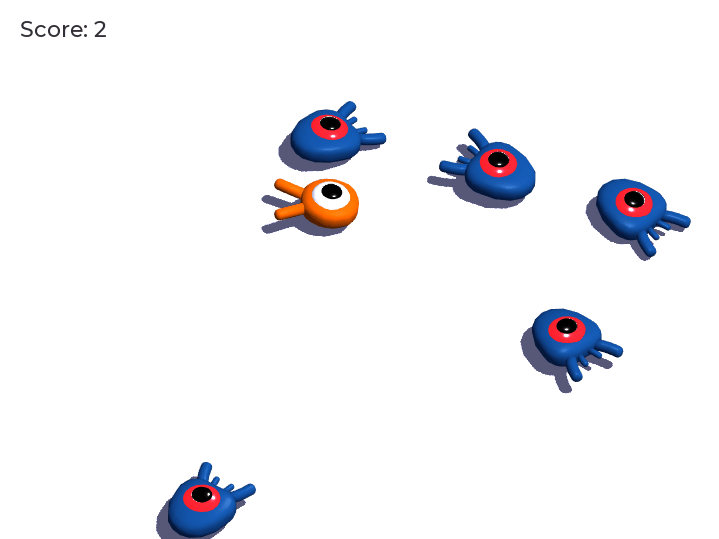

# Squash the Creeps 3D
A repo for following Godot's "Your First 3D Game" tutorial
### Squash Creeps
Featuring 
 - 3D coordinates & jumping mechanic
 - Kinematic bodies (movement & collision detection)
 - Physics layers for entity interaction detection
 - Procedural gameplay
 - Movement animation with alternating speed! (woah, very cool!)
 - Squashing

## Credits
`art/House In a Forest Loop.ogg` Copyright &copy; 2012 [HorrorPen](https://opengameart.org/users/horrorpen), [CC-BY 3.0: Attribution](http://creativecommons.org/licenses/by/3.0/). Source: https://opengameart.org/content/loop-house-in-a-forest

